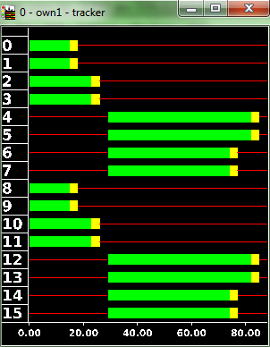
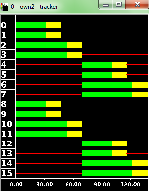

# tlsCoordinator.py

This script modifies the traffic-light offsets to coordinate them for a
given traffic demand. Example call:

```
python tools/tlsCoordinator.py -n net.net.xml -r routes.rou.xml -o tlsOffsets.add.xml
```

This would generate the file *tlsOffsets.add.xml* which can be loaded
into [sumo](../sumo.md):

```
sumo -n net.net.xml -r routes.rou.xml -a tlsOffsets.add.xml
```

!!! note
    It is advisable to run this with a *.net.xml* file where all traffic lights have the same cycle time. This is the default since version 0.25.0 but older networks should be rebuilt

!!! caution
    The route input must contain `<vehicle>`s with `<route>`-child-elements. Flows and trips are not supported.

# tlsCycleAdaptation.py

This script modifies the cycle lenth and the duration of green phases according to Websters
formula to best accommodate a given traffic demand. Example call:

```
python tools/tlsCycleAdaptation.py -n net.net.xml -r routes.rou.xml -o newTLS.add.xml -b begin_time
```

This would generate the file *newTLS.add.xml* which can be loaded into
[sumo](../sumo.md):

```
sumo -n net.net.xml -r routes.rou.xml -a newTLS.add.xml
```

!!! caution
    The route input must contain `<vehicle>`s with `<route>`-child-elements. Flows and trips are not supported. Vehicles with departure time = 'triggered' are not considered.

!!! note
    The begin time is not mandatory. However, the begin time will be the earliest departure time in the given route file, if it is not given. The flows within 1 hour from the begin time on are considered. If the whole period in the given route file is less than 1 hour, the flows will be proportionally scaled up to 1-hour flows. If the period is longer than 1 hour and no begin time is given, the 1-hour 
  peak-flows will be used. 

## Remarks

The calcuation in this script are based on static hourly traffic flows. Therefore, the flow pattern (e.g. vehicles arriving only in the first 10 minutes) within a hourly flow cannot be reflected in the Webster's equation. Accordingly, the suggested signal timing plans may not correspond to the traffic situation in the microscopic simulation. Several parameters in the options may need to be adjusted according to the given use case. Some remarks for helping to get proper results are listed below.

- Hourly flow: 
    Currently, this script only considers flows for one hour corresponding to the basic Webster's equation. So, the begin time needs to be given for getting the correct flows from the route file. Otherwise, the begin time = 0 is used as default, and the end time is then 3600 s. If the given period is longer than 1 hour, it is recommended to firstly find out the peak-hour begin time and use it in the script. If the given period is less than 1 hour, this script will still treat the respective flow as hourly flow. It is planned to scale/extract hourly flow from a given route file.

- Allocation of the movements at intersections: 
    In the basic Webster's equation, critical flows are calculated according to the given signal groups. So, generally speaking, flows with the same direction and in the same green time phase are summed up. The capacity is then calculated according to the number of lanes, which the respective flows are allowed to use. Accordingly, the critical flow group for each signal phase can be identified. This script does the same thing. If through and right-turn movements share the same green time phase at an intersection and they can only respectively use one lane in the microscopic simulation, i.e. there is no shared lane for both through and right-turn movements, the respective capacity will be over-estimated for through-movement. To avoid such situation, the rightmost lane needs to be set as shared lane for both right-turn and through movements. 
   
- Lane capacity: 
    In this script, the capacity is controlled by the option saturation-headway. As default, saturation-headway is set to 2 s. So, the default capacity is 1800 veh/lane/hour, which is for a longer road section normally. If the distance between any two intersections is quite short, e.g. 500 m in a city area, it is expected that the capacity is lower than the default capacity. It is needed to consider increasing the saturation-headway for adjusting the lane capacity.

- Currently, the considered road users (veh.type) include car, truck, trailer, bus, coach, moped, motorcycle, bicycle. PCE (Passenger Car Equivalents) is used as flow unit. 

- Synchronizaton of traffic signals: 
    This script only deals with the signal timing optimization at one intersection at a time, and does not synchronize the traffic signals across all intersections. So, poor results could happen if there is any conflict between signal plans. The script [tlsCoordinator.py](#tlscoordinatorpy) can be used to coordinate traffic signals.
    
# tls_csv2SUMO.py

This tool requires the program definition and the SUMO-network it shall
be converted to:

```
python tools/tls/tls_csv2SUMO.py <TLS_CSV> <NET>
```

It prints the generated TLS definition on stdout (you can pipe it to a
file).

The format of the CSV description is as following. At first, three
header lines must be given, which name the tls (which is the id of the
tlLogic in the network), the program's subkey, and the offset at which
the program shall start in seconds - normally 0:

```
    key;<KEY>
    subkey;<SUBKEY>
    offset;<OFFSET>
```

Then, it is defined which signal (number) in the program is responsible
for which link. The link may be described either using the incoming edge
only, or the incoming lane only, or also incorporating the outgoing
edge/lane. This means the following lines are all valid:

```
    link;<LINK_NUMBER>;<FROM_EDGE>;;0
    link;<LINK_NUMBER>;<FROM_LANE>;;0
    link;<LINK_NUMBER>;<FROM_EDGE>;<TO_EDGE>;0
    link;<LINK_NUMBER>;<FROM_EDGE>;<TO_LANE>;0
    link;<LINK_NUMBER>;<FROM_LANE>;<TO_EDGE>;0
    link;<LINK_NUMBER>;<FROM_LANE>;<TO_LANE>;0
```

It is also possible to assign more than one link to a single signal.

Then, the signals' states are given:

```
<LINK_NUMBER>;<STATES>
```

The states are encoded using the signal colors (please note that only
lower-case letters are used, see below) described above, separated by
';'. An example signal phase definition (for signal 1) could be:

```
1;g;g;g;g;y;r;r;r;r;r
```

Please not that the number of states must be the same for all defined
links.

Now, we only have to define the phase times:

```
time;<TIMES>
```

The times are given in seconds, again separated using ';'. An example
could be:

```
time;18;33;3;6;3;3;9;15;90
```

A complete CSV-description could look like:

```
    key;102
    subkey;utopia
    offset;0
    link;1;4643;;0
    link;1;3078;;0
    link;2;3074;;0
    link;2;-6494;;0
    1;g;g;y;r;r;r;r;r
    2;r;r;r;r;g;g;y;r
    3;r;r;r;r;g;y;y;r
    4;g;y;y;r;r;r;r;r
    min;21;3;3;2;20;9;3;2
    time;45;3;3;2;36;9;3;2
    max;78;3;3;2;62;9;3;2
```

## Example

The example shows what is tested in
[\[1\]](https://sourceforge.net/apps/trac/sumo/browser/trunk/sumo/tests/tools/tls/csv2sumo/both_ok).
It is not a real-world program plan, only a demonstration for using the
script.

We have a simple four-arms intersections which is controlled by traffic
lights, see next figure.

**Figure: example intersection**


Now, we define two different programs for this intersection. The first:

```
key;0
subkey;own1
offset;0
link;1;4si;3o;0
link;1;4si;1o;0
link;1;3si;4o;0
link;1;3si;2o;0
link;2;4si;4o;0
link;2;4si;2o;0
link;2;3si;1o;0
link;2;3si;3o;0
link;3;1si;1o;0
link;3;1si;4o;0
link;3;2si;2o;0
link;3;2si;3o;0
link;4;1si;3o;0
link;4;1si;2o;0
link;4;2si;1o;0
link;4;2si;4o;0
1;g;y;r;r;r;r;r;r;r;r
2;g;g;g;y;r;r;r;r;r;r
3;r;r;r;r;r;g;y;r;r;r
4;r;r;r;r;r;g;g;g;y;r
min;10;3;5;3;3;10;3;5;3;3
time;15;3;5;3;3;45;3;5;3;3
max;30;3;15;3;3;60;3;15;3;3
```

This means that we have four streams: two for north/south (edges 3si and
4si) and two for east/west (edges 1si and 2si). Two, because we give
green longer for the respective left-movers. The key is the ID of the
traffic light ("0"), the subkey is the name of our program ("own1").

The second program looks like this:

```
key;0
subkey;own2
offset;0
link;1;4si;3o;0
link;1;4si;1o;0
link;1;3si;4o;0
link;1;3si;2o;0
link;2;4si;4o;0
link;2;4si;2o;0
link;2;3si;1o;0
link;2;3si;3o;0
link;3;1si;2o;0
link;3;1si;3o;0
link;3;2si;1o;0
link;3;2si;4o;0
link;4;1si;4o;0
link;4;1si;1o;0
link;4;2si;3o;0
link;4;2si;2o;0
1;g;y;r;r;r;r;r;r
2;g;g;g;y;r;r;r;r
3;r;r;r;r;g;y;r;r
4;r;r;r;r;g;g;g;y
time;31;16;6;16;31;16;6;16
```

We convert those program definitions using

```
python tools/tls/tls_csv2SUMO.py lsa_def.csv,lsa_def2.csv input_net.net.xml
```

And obtain the following programs after loading them into
[sumo-gui](../sumo-gui.md):

**Figure: converted programs**




# tls_csvSignalGroups.py

Converts a csv-tls-description into one SUMO can read as additional
file (and vice versa). This tool differs from **tls_csv2SUMO.py** by being based on
signal groups in a way that is closer to the typical representation used
by traffic engineers. It accepts green times per signal group and
creates the [sumo](../sumo.md) tls representation out of it. Example call to convert two csv-tls-descriptions into the
additional file *tls.add.xml*:

```
python tools/tls/tls_csvSignalgroups.py -n net.net.xml -i tl1.csv,tl2.csv -o tls.add.xml
```

In the opposite direction, templates for csv-tls-descriptions of all tls
in a [sumo](../sumo.md) network can be written to a given directory
and completed by hand:

```
python tools/tls/tls_csvSignalgroups.py -n net.net.xml -m .
```
It also provides a mechanism to convert an additional file *tls.add.xml* or the TL logic contained in a 
net file *net.net.xml* directly into a csv-tls-representation. Example call to convert an additional file *tls.add.xml* 
into csv-tls-representation(s):

```
python tools/tls/tls_csvSignalgroups.py -n net.net.xml -i tls.add.xml -r --group
```
The csv output files (one per found TL logic) are written to the current working directory and named *tlID_programID.csv*. An additional file 
prefix can be prepended using the **--output** parameter. When adding the parameter **--group**, signal groups with identical signal states across all 
examined TL logics are joined.

!!! caution
    The conversion from an additional file *tls.add.xml* to csv may be lossy in some cases, as only a limited subset of actuated 
    traffic lights is supported. If `minDur` attribute is set, then the time between the respective cycle second and the phase end after 
    `duration` seconds is recorded in the csv output.

The input csv file contains input blocks divided by titles in brackets.
The block \[general\] sets general information relating to the signal
program like the tls ID, the program ID, the cycle time \[s\] and the
offset time \[s\]. Additional 0..n optional parameters can also be
supplied. The \[links\] block lists the relations between signal groups
and junction connections in [sumo](../sumo.md). The relation is
build from the edges/lanes controlled by the respective signal group.
The target edge/lane can be omitted. The last block \[signal groups\]
contains the table of green times and signal group properties. The table
uses a header row with the following keywords and their meanings:

| Header   | Description                                                                           |
| -------- | ------------------------------------------------------------------------------------- |
| id       | signal group id, see block \[links\]                                                  |
| on1      | start time (signal state green) \[s\] for the first green time in the cycle           |
| off1     | end time (signal state green) \[s\] for the first green time in the cycle             |
| on2      | optional start time (signal state green) \[s\] for the second green time in the cycle |
| off2     | optional end time (signal state green) \[s\] for the second green time in the cycle   |
| transOn  | duration \[s\] for special signal state before green (red-yellow)                     |
| transOff | duration \[s\] for special signal state after green (yellow)                          |

The keywords may have a different order than shown above. The definition
of a second green time per cycle (keywords *on2* and *off2*) is
optional, so are the keywords.

## Example with a single green phase per signal group

```
[general]
cycle time;60
key;1
subkey;SZP_LeftTurn
offset;0
parameter;key1;value1
parameter;key2;value2
[links]
FZ11;-474_0;
FZ12;-474_1;
FZ21;-472_0;
FZ31;-468_0;
FZ32;-468_1;
FZ41;-470_0;
[signal groups]
id;on1;off1;transOn;transOff
FZ11;0;25;1;3
FZ12;0;35;1;3
FZ21;40;55;1;3
FZ31;0;25;1;3
FZ32;0;35;1;3
FZ41;40;55;1;3
```

## Example with two green phases for some groups

```
[general]
cycle time;60
key;1
subkey;SZP_2Green
offset;0
[links]
FZ11;-474_0;
FZ12;-474_1;
FZ21;-472_0;
FZ31;-468_0;
FZ32;-468_1;
FZ41;-470_0;
[signal groups]
id;on1;off1;transOn;transOff;on2;off2
FZ11;0;15;1;3;;
FZ12;0;15;1;3;40;55
FZ21;25;35;1;3;;
FZ31;0;25;1;3;;
FZ32;0;15;1;3;40;55
FZ41;25;35;1;3;;
```

## Example for an actuated traffic light

The **actuated** setting defines a list of times (given as cycleSeconds). Each pair defines the start and end of an actuation range.
The difference between each pair of values corresponds to the difference between *minDur* and *maxDur* and thus the possible length extension.

```
[general];;;;;;
cycle time;60;;;;;
key;1;;;;;
subkey;SZP_Prio;;;;;
offset;5;;;;;
actuated;5;10
[links];;;;;;
FZ11;-474_0;;;;;
FZ11;-474_1;;;;;
FZ21;-472_0;;;;;
FZ31;-468_0;;;;;
FZ31;-468_1;;;;;
FZ41;-470_0;;;;;
[signal groups];;;;;;
id;on1;off1;transOn;transOff;;
FZ11;0;10;1;3;;
FZ21;15;25;1;3;;
FZ31;30;40;1;3;;
FZ41;45;55;1;3;;
```

# buildTransitions.py

This tool creates tlLogic definitions with branching signal plans based on a simplified
input: named green phases and list of successor green phases names.
The corresponding yellow and red phases will be build and the 'next' attribute
will be set to the appropriate transition phase.

```
python tools/tls/buildTransitions.py -d <tlLogic-file> -o <output-file>
```

